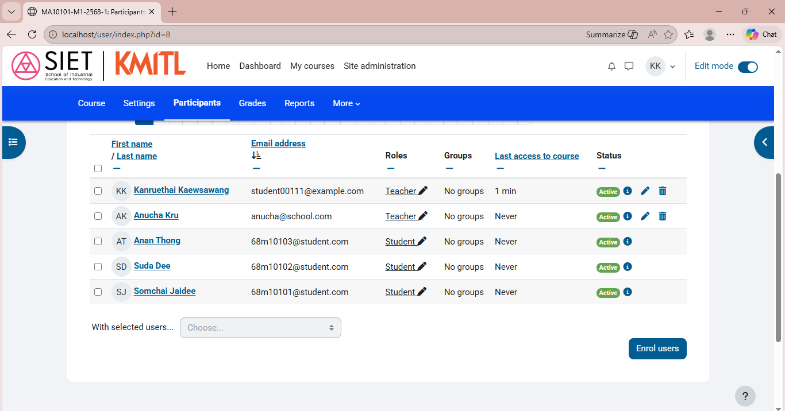

<!--  # บันทึกรูปหน้า Category -->

<!--  # บันทึกรูปหน้า cohorts -->

<!--  # บันทึกรูปหน้า Users (Student) -->

<!--  # บันทึกรูปหน้า Users (Teacher) -->

<!-- # บันทึกรูปหน้า Course -->

<!-- # บันทึกรูปหน้า Enroll Users ครู -->

<!-- # บันทึกรูปหน้า Enroll Users นักเรียน -->

<!-- # บันทึกรูปหน้า เพิ่ม Activities -->

คำถามท้ายการทดลอง

**1.** อธิบายความแตกต่างระหว่าง Category และ Cohort 
ตอบ Category คือการจัดกลุ่มเชิงโครงสร้าง โดยอิงตามประเภทหรือคุณสมบัติที่คงที่ เพื่อความเป็นระเบียบ แต่Cohort คือการจัดกลุ่มตาม ช่วงเวลาหรือพฤติกรรมร่วมกัน เพื่อติดตามพัฒนาการของกลุ่มที่เฉพาะเจาะจง

**2.** เหตุใดควรใช้ Cohort sync 
ตอบ ช่วยให้การบริหารจัดการรายชื่อผู้ใช้งานเได้แบบอัตโนมัติและแม่นยำแบบเรียลไทม์ช่วยลดภาระงานซ้ำซ้อนและป้องกันความผิดพลาดจากการคีย์ข้อมูลด้วยมือ

**3.** Best practices สำหรับ Category structure คือแบบใด
ตอบ โครงสร้างหมวดหมู่ที่ดีต้องมีความเรียบง่ายไม่ซับซ้อน โดยใช้การตั้งชื่อที่สื่อความหมายชัดเจนและไม่ทับซ้อน เพื่อให้ระบบรองรับการขยายตัวได้ดีในระยะยาว