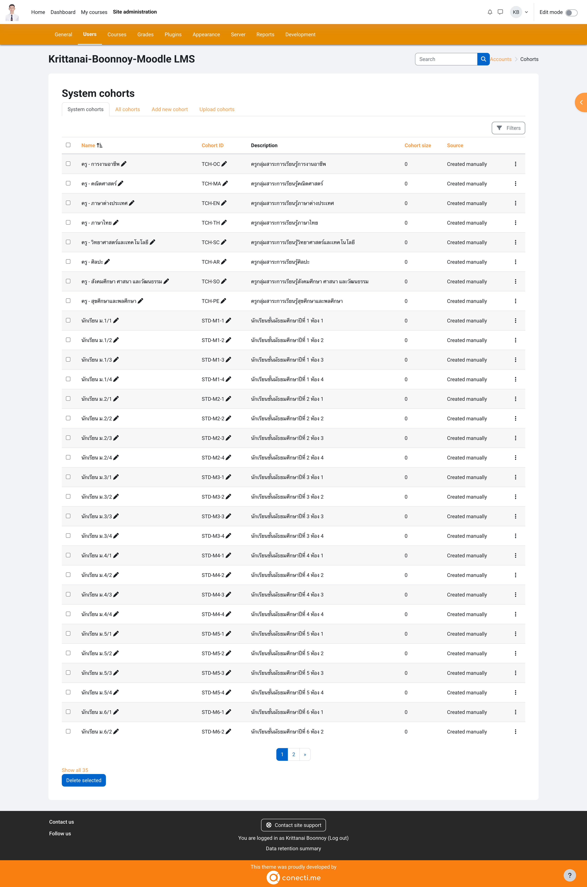

# รายงานผลการทดลอง: การบริหารจัดการ Moodle LMS สำหรับผู้ดูแลระบบ (Lab 2)

| รหัสนักศึกษา | ชื่อ-นามสกุล |
|-------------|--------------|
| 67030011 | กฤตนัย บุญน้อย |

---

## ส่วนที่ 1: บันทึกผลการทดลอง

### บันทึกที่ 1: การตั้งค่าเริ่มต้นของระบบ

ตั้งค่าภาษา เขตเวลา Password Policy การลงทะเบียน และ Automated backup ตามใบงาน


---

### บันทึกที่ 2: หน้า Category

Site administration > Courses > Manage courses and categories — โครงสร้างปีการศึกษา 2568, ภาคเรียนที่ 1, มัธยมต้น/ปลาย, ชั้น ม.1–ม.6


---

### บันทึกที่ 3: หน้า Cohorts ที่สร้างแล้ว

Upload cohorts จากไฟล์ `cohorts/cohorts.csv` (หรือ cohorts-secondary-school.csv)



---

### บันทึกที่ 4: ผลการ Upload Users (Student)

Upload จาก `users/students_m1-1.csv`


---

### บันทึกที่ 5: ผลการ Upload Users (Teacher)

Upload จาก `users/teachers_sample.csv`


---

### บันทึกที่ 6: หน้า Course หลัง Upload courses

เลือกไฟล์จากโฟลเดอร์ `courses/` (เช่น courses-secondary-school.csv)


---

### บันทึกที่ 7: Enroll ครูและนักเรียน (Cohort sync)


---

### บันทึกที่ 8: หน้ารายวิชาที่ Enrol User แล้ว


---

### บันทึกที่ 9: หน้ารายวิชาที่เพิ่ม Activities (Page, Assignment, Quiz)


---

## ส่วนที่ 2: คำตอบท้ายการทดลอง (3 ข้อ)

### ข้อ 1: อธิบายความแตกต่างระหว่าง Category และ Cohort

```
Category ใช้จัดกลุ่มรายวิชา เป็นโครงสร้างแบบลำดับชั้น เช่น ปีการศึกษา ภาคเรียน ระดับชั้น ส่วน Cohort ใช้จัดกลุ่มผู้ใช้ เช่น นักเรียนห้องเดียวกัน ครูกลุ่มสาระ เมื่อลงทะเบียนเรียนแบบ Cohort sync ผู้ใช้ใน cohort นั้นจะถูกเพิ่มเข้าเรียนในรายวิชาอัตโนมัติตามที่ตั้งไว้
```

---

### ข้อ 2: เหตุใดควรใช้ Cohort sync

```
เพราะลงทะเบียนเป็นกลุ่มได้ครั้งเดียว ไม่ต้องเพิ่มทีละคน เมื่อมีนักเรียนใหม่เข้า cohort ก็จะได้เข้าเรียนในรายวิชาที่เปิด sync ไว้เอง ลดงานซ้ำและจัดการง่ายเวลามีหลายห้องหลายวิชา
```

---

### ข้อ 3: Best practices สำหรับ Category structure คือแบบใด

```
ควรตั้งชื่อให้สอดคล้องกัน ใช้ ID number เป็นรหัสประจำ category จำกัดความลึกไม่เกิน 3–4 ระดับ และออกแบบให้ขยายหรือเพิ่มระดับชั้นในปีถัดไปได้ไม่ยุ่งยาก
```

---

## ไฟล์ประกอบการทดลอง

| ไฟล์ | คำอธิบาย |
|------|----------|
| [Moodle-admin-Lab2.md](Moodle-admin-Lab2.md) | ใบงานและขั้นตอนทำ Lab 2 ทั้งหมด |
| [SETUP.md](SETUP.md) | คู่มือตั้งค่าและใช้งาน Repo นี้ |
| [cohorts/cohorts.csv](cohorts/cohorts.csv) | Upload Cohorts (มัธยม) ตามข้อ 3.1 |
| [cohorts/cohorts-secondary-school.csv](cohorts/cohorts-secondary-school.csv) | Upload Cohorts มัธยม |
| [cohorts/cohorts-vocational.csv](cohorts/cohorts-vocational.csv) | Upload Cohorts อาชีวศึกษา |
| [courses/courses-secondary-school.csv](courses/courses-secondary-school.csv) | Upload Courses มัธยม |
| [courses/courses-vocational.csv](courses/courses-vocational.csv) | Upload Courses อาชีวศึกษา |
| [users/students_m1-1.csv](users/students_m1-1.csv) | Upload Users (นักเรียน ม.1/1) |
| [users/students_sample.csv](users/students_sample.csv) | ตัวอย่าง CSV นักเรียน |
| [users/teachers_sample.csv](users/teachers_sample.csv) | Upload Users (ครู) |
| [csv-templates/](csv-templates/) | ไฟล์ตัวอย่าง CSV ตามที่ใบงานอ้าง |
| [content/content-page-1.1-MA10101.txt](content/content-page-1.1-MA10101.txt) | เนื้อหาตัวอย่างสำหรับ Page ใน Moodle |

---

## โครงสร้างโฟลเดอร์

```
Moodle-admin-Lab2-2025/
├── README.md                       # รายงานผลการทดลอง (ไฟล์นี้)
├── Moodle-admin-Lab2.md            # ใบงานฉบับเต็ม
├── SETUP.md                         # คู่มือตั้งค่า
├── .gitignore
├── cohorts/                         # ไฟล์ CSV สำหรับ Upload Cohorts
│   ├── cohorts.csv
│   ├── cohorts-secondary-school.csv
│   └── cohorts-vocational.csv
├── courses/                         # ไฟล์ CSV สำหรับ Upload Courses
│   ├── courses-secondary-school.csv
│   └── courses-vocational.csv
├── users/                           # ไฟล์ CSV สำหรับ Upload Users
│   ├── students_m1-1.csv
│   ├── students_sample.csv
│   └── teachers_sample.csv
├── csv-templates/                   # ไฟล์ตัวอย่างตามที่ใบงานอ้าง
│   ├── students_sample.csv
│   └── teachers_sample.csv
├── content/                         # เนื้อหาตัวอย่างสำหรับกิจกรรมใน Moodle
│   └── content-page-1.1-MA10101.txt
└── images/                          # รูปประกอบและ Screenshots
    ├── Moodle-role.png
    ├── screencapture-localhost-cohort-index-php-2026-02-13-10_21_35.png
    └── (Screenshot 2569-02-13 at *.png)
```
